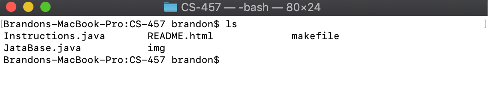
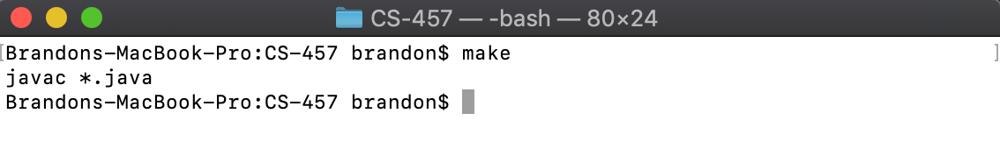
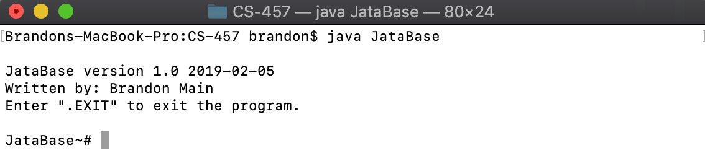
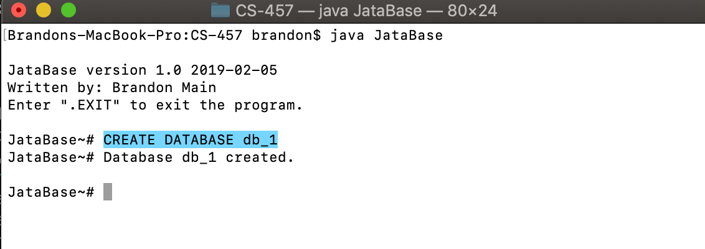
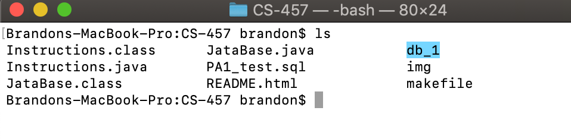
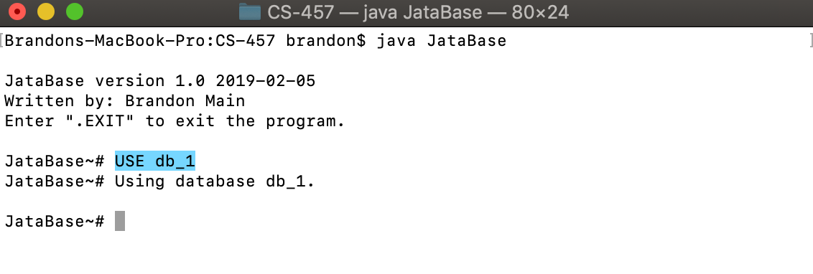
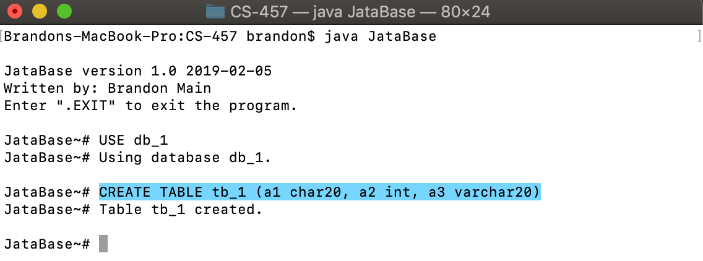
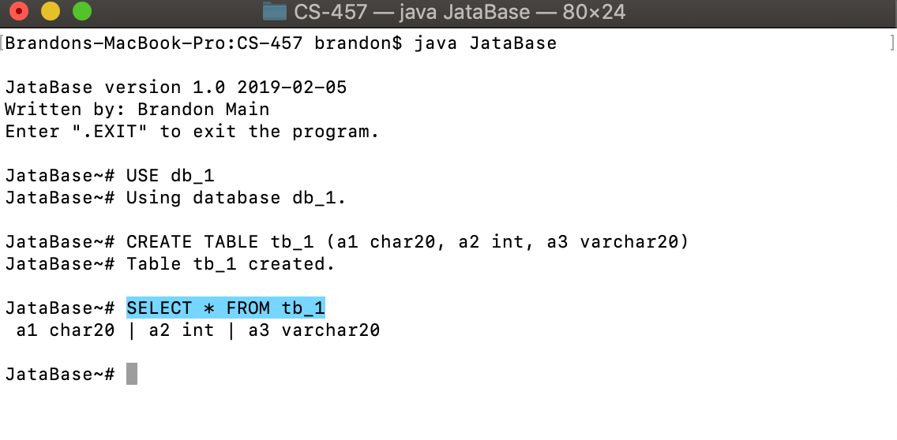
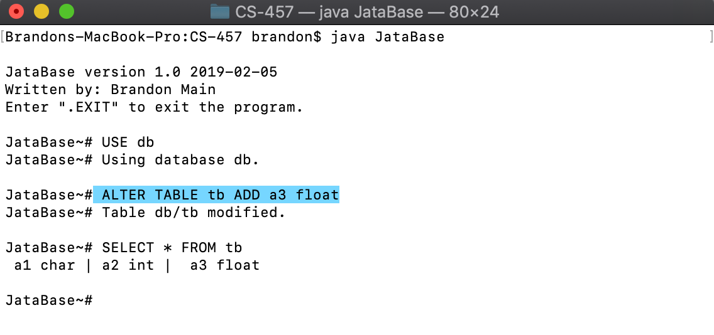

JataBase version 1.0

Written by: Brandon Main

Date: February 20, 2019

## README

### How to compile and run:

Download and unzip the .tar.gz file in your working directory. You should then contain the following files such as those listed in the screenshot below:

First we must compile the java files by issueing the `make` command:

After compiling we can now run the JataBase program using a file as a command line arguement or by inputing commands by issueing the `java JataBase <FILE | NULL>` commands at the command line.

### Database Organization

This program is designed to treat each individual database as a directory. Therefore, whenever a new database is created, a new directory in the current working directory is created with the name that is given. Databases within databases could even be created if desired. Below is an example of how to create a database.

Create a database:

`JataBase~# CREATE DATABASE <DATABASE-NAME>` 

Listing the contents of your working directory will then show the databases newly created folder:

### Table Management

With databases treated as directories, each of the tables in the databases are treated as individual files within the databases directory. In order to create a table there must already be a database created, and that database must be specified as the database you are using by issueing the `JataBase~# USE <DATABASE-NAME>` command. Below is an example of how to perform the operation of creating a table.

First a database must be used:

`JataBase~# USE <DATABASE-NAME>` 

Then a table can be created:

`JataBase~# CREATE TABLE <TABLE-NAME> (VALUES_1, ..., VALUE_N)` 

A tables contents can be viewed by issueing the `SELECT` command:

`JataBase~# SELECT * FROM <TABLE-NAME>` 

A tables contents can also be altered by issueing the `ALTER` command:

### How does it all work?

To implement the required functionalities of this project I found it best to write the program in java, hence the name JataBase (Java + Database). By reading in a file of strings consisting of commands for the database or reading from the command line, the program can easily parse the commands and decide what to do next. Based on what is input from file or from the command line the program then calls the corresponding function to handle the command. If the command is not recognized the program will print an error to the terminal and continue running.